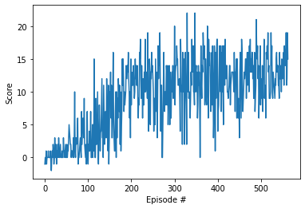
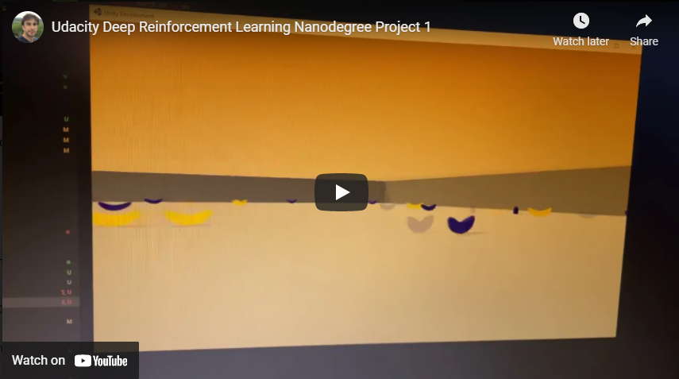

# Banana Navigation

## Table of Contents  

[Algorithm](#Algorithm)

[Hyperparameters and Model](#Hyperparameters-and-Model)

[Rewards](#Rewards)

[Solved Agent](#solved-agent)

[Future Work](#Future-Work)  

## Algorithm

The model used is the [DQN](https://deepmind.com/research/publications/human-level-control-through-deep-reinforcement-learning). The paper can be found [here](./DQNNaturePaper.pdf).

## Hyperparameters and Model

The network has been built using a sequential model with three linear fully connected layers of 78 neurons and a RELU activation.

* Buffer Size = 1e5
* Batch Size = 64
* Discount Factor (GAMMA)  = 0.99
* TAU (for soft update of target parameters) = 0.001
* Learning Rate = 0.0005
* Update Network every 4 step

## Rewards

A reward of +1 is provided for collecting a yellow banana, and a reward of -1 is provided for collecting a blue banana.  Thus, the goal of your agent is to collect as many yellow bananas as possible while avoiding blue bananas.  

The evolution of the reward is displayed in the graph below:

## Solved Agent

Here's an example run of the solved agent:

{:target="_blank"}

## Future Work

The next challenge would be to solve this environment [using raw pixel data](#challenge-learning-from-pixels) from a convolutional neural network. The model and it's convergence become a bit more complicated, and CUDA memory management becomes something to bare in mind.

The algorithm used for this task has been further improved in the following work which is worth exploring.

* A Distributional Perspective on Reinforcement Learning [arxiv](https://arxiv.org/pdf/1707.06887.pdf)
* Rainbow: Combining Improvements in Deep Reinforcement Learning [arxiv](https://arxiv.org/abs/1710.02298)
* Hierarchical Deep Reinforcement Learning [arxiv](https://arxiv.org/abs/1604.06057)

### Challenge: Learning from Pixels

Below is the description of the "Visual Banana Challenge" from udacity. Work on this has started, but it proved more demanding and I have not yet put enough time into it.

After you have successfully completed the project, if you're looking for an additional challenge, you have come to the right place!  In the project, your agent learned from information such as its velocity, along with ray-based perception of objects around its forward direction.  A more challenging task would be to learn directly from pixels!

To solve this harder task, you'll need to download a new Unity environment.  This environment is almost identical to the project environment, where the only difference is that the state is an 84 x 84 RGB image, corresponding to the agent's first-person view.  (**Note**: Udacity students should not submit a project with this new environment.)

You need only select the environment that matches your operating system:
- Linux: [click here](https://s3-us-west-1.amazonaws.com/udacity-drlnd/P1/Banana/VisualBanana_Linux.zip)
- Mac OSX: [click here](https://s3-us-west-1.amazonaws.com/udacity-drlnd/P1/Banana/VisualBanana.app.zip)
- Windows (32-bit): [click here](https://s3-us-west-1.amazonaws.com/udacity-drlnd/P1/Banana/VisualBanana_Windows_x86.zip)
- Windows (64-bit): [click here](https://s3-us-west-1.amazonaws.com/udacity-drlnd/P1/Banana/VisualBanana_Windows_x86_64.zip)

Then, place the file in the `p1_navigation/` folder in the DRLND GitHub repository, and unzip (or decompress) the file.  Next, open `Navigation_Pixels.ipynb` and follow the instructions to learn how to use the Python API to control the agent.

(_For AWS_) If you'd like to train the agent on AWS, you must follow the instructions to [set up X Server](https://github.com/Unity-Technologies/ml-agents/blob/master/docs/Training-on-Amazon-Web-Service.md), and then download the environment for the **Linux** operating system above.
